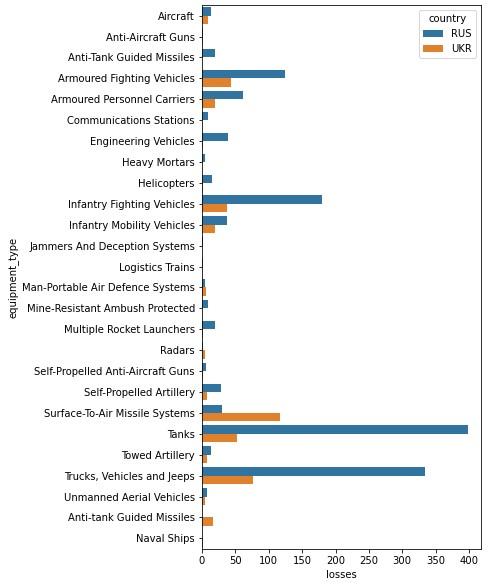

# scrape_oryx_py
Python scraper for https://www.oryxspioenkop.com/2022/02/attack-on-europe-documenting-equipment.html

R version: https://github.com/scarnecchia/scrape_oryx

## Binder demo

## Plotting Russian vs. Ukrainian losses

## Issues
* 'Flag'-data is ignored, i.e., country of equipment manufacturing. 
* Scraping some unnecessary elements as equipment types and statuses.
